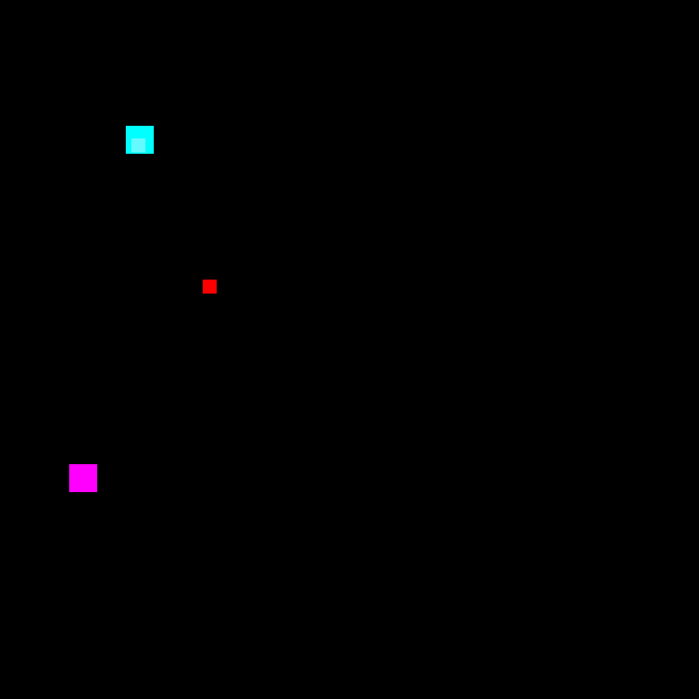
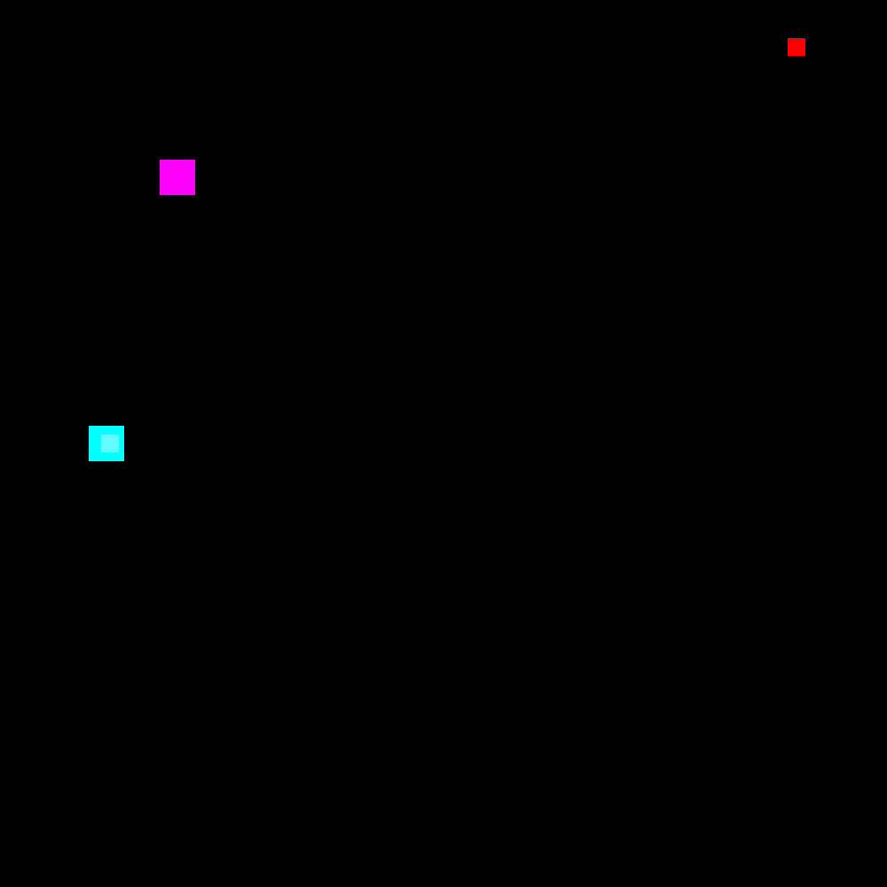

# hijacking-acas

The purpose of this git repository is to support the submitted paper to  ERTS2022. We developed an attack on the ACAS-Xu system using reinforcement learning (RL) methods.

Next GIFs gives interception trajectories for different initial position. Compare static figures provided in the paper, it enables reviewers to better understand the dynamic of an attack and strategies learned by the attacker.
The target is the little red square, that has the mission to reach the delivery area represented as the big purple square. The attacker is the little green square that will intercept the target and make it reaching the hijacking area represented as the big cyan square.
We present here several initial positions. In all of them, the target is hijacked and never reach the delivery area.

|  |  |
|:-:|:-:|
|   Cas 1|  Cas 2|
|   Cas 3|  Cas 4|

For the conference, this repository will be used to share results, but also, as explained in the paper, to propose in open source the gym environment of the ACAS-Xu. It would be the opportunity for the RL community to test new RL methods on an industrial use cases. 